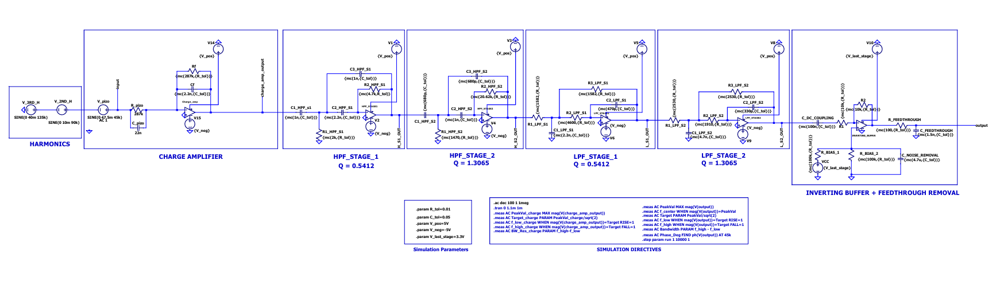
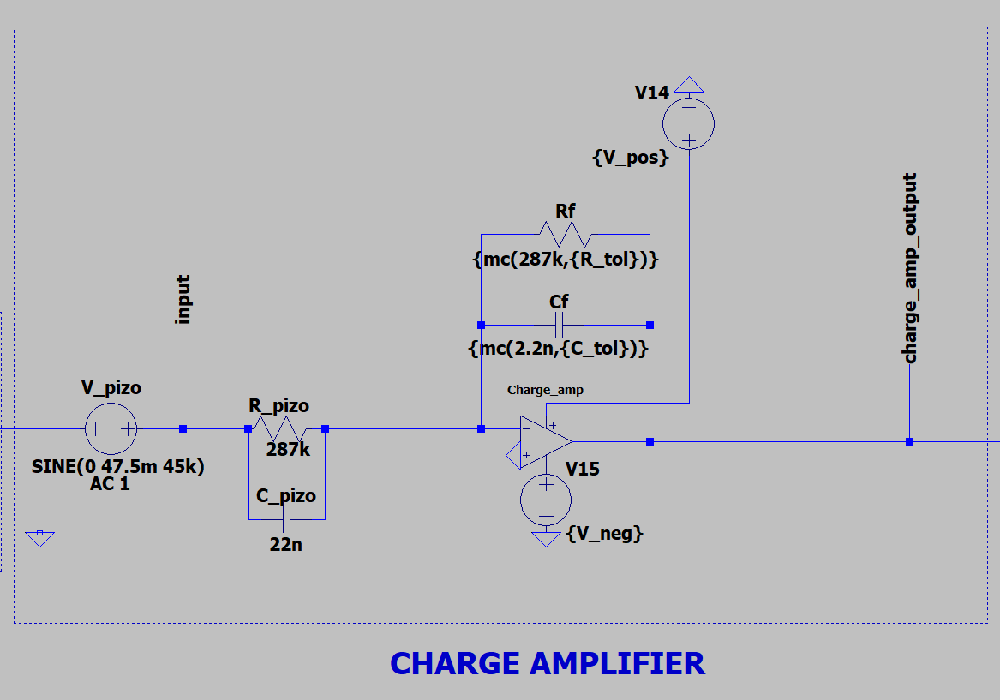
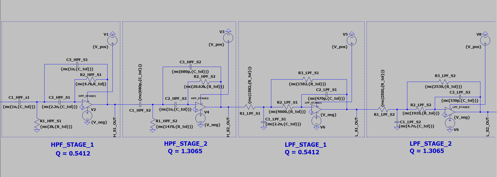
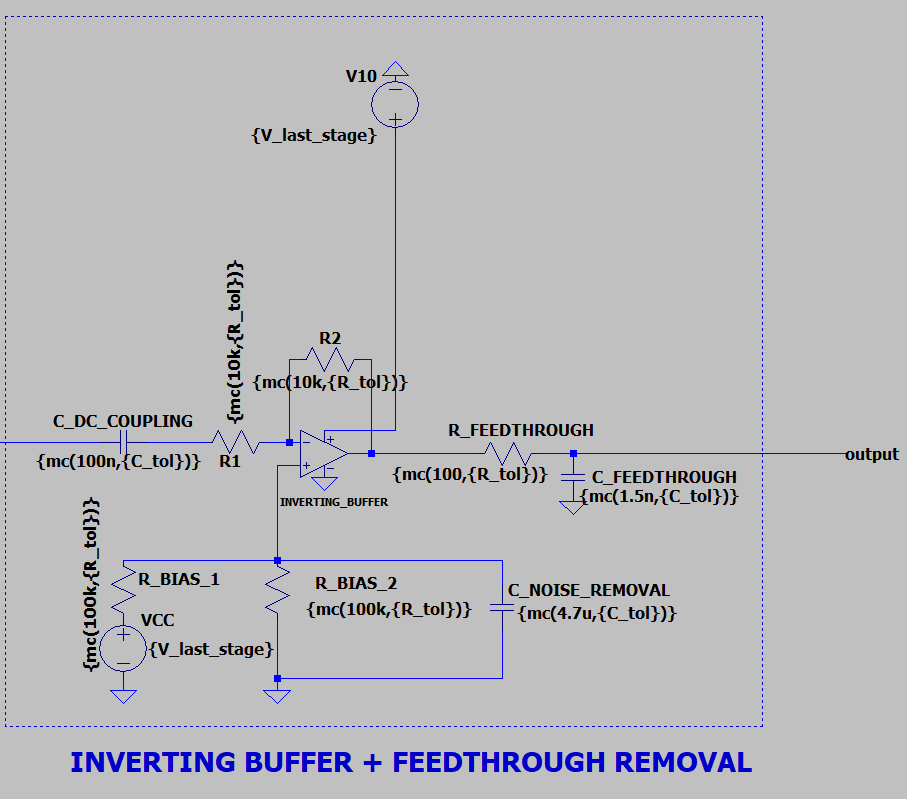
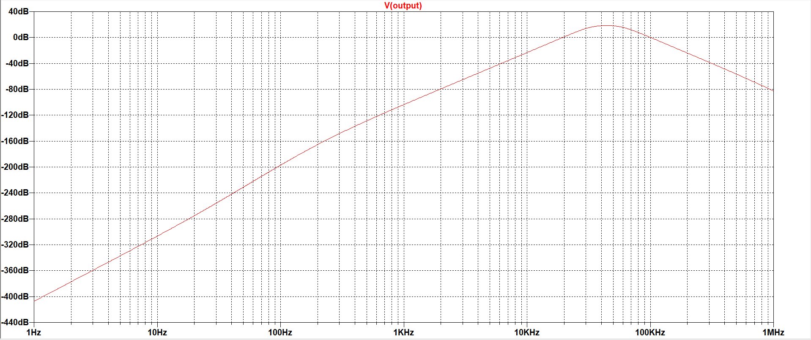
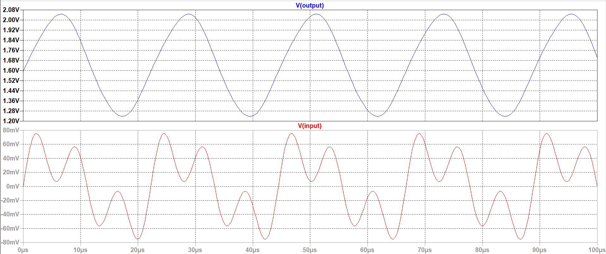
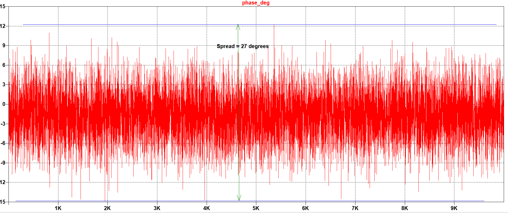

# Ultrasonic Underwater Acoustic Signal Acquisition and Conditioning Frontend

  

This repository contains the complete design, simulation files, computational scripts, and documentation for an analog frontend engineered to acquire **45 kHz continuous-wave (CW) tone bursts** from an Underwater Locator Beacon (ULB). 

The system acts as a highly resilient conditioning pipeline, bridging a raw piezoelectric hydrophone output to an Analog-to-Digital Converter (ADC) for Autonomous Underwater Vehicles (AUVs). It is designed to rigorously isolate specific frequency bands while rejecting severe mechanical noise, vibrational noise, environmental noise, and electromagnetic interference (EMI) due to ESC switching.

## 📁 Repository Structure

  * `Analog_Frontend_Project_Report.pdf` — Detailed theoretical derivations, BOM, and simulation results.
  * `adc_frontend.asc` — Complete LTspice schematic with all simulation directives.
  * `MFB_HPF_Butterworth.py` — Python algorithm for High-Pass Filter component derivation.
  * `MFB_LPF_Butterworth.py` — Python algorithm for Low-Pass Filter component derivation.
  * `images/` — Contains simulation plots and schematic images.

## ⚙️ System Architecture

The signal chain is divided into three primary functional blocks:

### 1. Sensor Modeling & Charge Amplifier
Converts piezoelectric charge produced directly into a proportional voltage. This renders the system's overall gain mathematically independent of cable capacitance.

### 2. 8th-Order Butterworth Bandpass Filter
Provides rigorous harmonic rejection and isolates the 45 kHz target tone. It establishes a passband from **35 kHz to 58 kHz** by cascading two 2nd-order High-Pass (HPF) and two 2nd-order Low-Pass (LPF) stages using Multiple Feedback (MFB) topologies.

### 3. Output Stage (Inverting Buffer & Kickback Filter)
Restores phase integrity (correcting the net 180° shift from the previous stages), biases the AC signal to **+1.65 V DC** for a unipolar 0-3.3V ADC, and provides a passive RC feedthrough filter ($f_{alias} \approx 1.06\text{ MHz}$) to protect against high frequency noise due to EMI that also acts as an ADC kickback filter.
  

## 🐍 Python Synthesis Scripts

High-Q MFB filter stages are notoriously sensitive to component variations. Calculating continuous theoretical values and simply rounding them to the nearest physical resistor often causes severe center-frequency drift. 

To solve this, the two included Python scripts use a custom algorithm to bridge theoretical transfer functions with physical hardware constraints:
* **E-Series Anchoring:** Iteratively sweeps through standard **E6 series capacitors** (100 pF to 10 nF) to anchor the math to real-world parts.
* **Discriminant Evaluation:** Explicitly rejects capacitor combinations that result in imaginary resistor solutions.
* **Manufacturing Bounds:** Outputs strictly constrained resistor values within a physically practical and noise-minimized manufacturing range (1 kΩ to 1 MΩ).

## 📈 Simulation & Validation (LTspice)

The `adc_frontend.asc` LTspice file includes complete models to validate the hardware. Open the file in LTspice and run the following analyses:

### 1. AC Analysis (Frequency Response)
Validates the broadband flat-band gain of the charge amplifier and the steep >80 dB/decade roll-off of the 8th-order Butterworth filter.
> **Note:** Uncomment `.ac` directive to run.

### 2. Transient Analysis & Harmonic Rejection
Confirms steady-state phase integrity, the 788.7 mVp-p amplitude scaling, proper 1.65V DC biasing, and robust rejection of severe out-of-band harmonics (90 kHz and 135 kHz).
> **Note:** Uncomment `.tran` directive to run.

### 3. Monte Carlo Statistical Yield
A 10,000-run statistical yield simulation applying a Gaussian distribution to the 1% (Resistors) and 5% (Capacitors) tolerances. This quantifies a worst-case channel-to-channel phase drift of $\approx 27^\circ$, validating the frontend for short-range Time Difference of Arrival (TDOA) applications.
> **Note:** Uncomment the `.step param run` directive to execute.

*Uncomment the other directives in the schematic to measure various other parameters like the 3dB cutoff points and midband gain.*

## 📄 Documentation

For full mathematical derivations of the transfer functions, theoretical vs. simulated error tables, and a complete Consolidated Manufacturing Bill of Materials (BOM), please refer to the [Analog_Frontend_Project_Report](Analog_Frontend_Project_Report.pdf) included in this repository.

---
**Author:** Hrishikesh Acharyya  
**Domain:** Electrical Engineering / Acoustic Signal Processing
